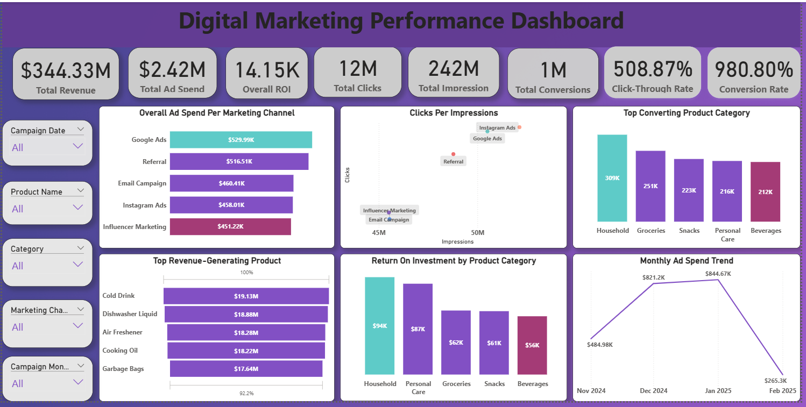
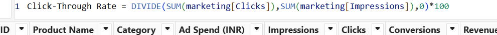
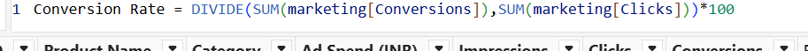

# digital-marketing-performance

---
## INTRODUCTION

In this project, I worked as a data analyst to design and build an interactive Power BI dashboard for monitoring the performance of digital marketing campaigns across multiple channels, including email, Instagram ads, and influencer marketing.
The goal was to provide stakeholders with a clear, real-time view of campaign performance and help optimize future marketing strategies.

## PROBLEM STATEMENT

- Which marketing channel had the highest ad spend?
- How do clicks compare to impressions across different campaigns?
- What is the conversion rate by product category?
- Which products generated the highest revenue?
- How does ROI vary across products and categories?
- What are the time-based trends for ad spend, conversions, ROI, and clicks?

## SKILLS DEMONSTRATED

- Data Cleaning & Preparation on Power Query
- DAX calculations to create measures for Click-Through Rate (CTR), Conversion Rate, ROI, total impressions, clicks, revenue, and conversions to enable dynamic and accurate reporting.
- Data Visualization and Dashboard Design in Power BI—Designed interactive visuals such as bar charts, line charts, and KPI cards to communicate insights effectively. I also built a clean, professional, and user-friendly dashboard with consistent formatting, color coding, and a clear visual hierarchy.
- Interactivity & Filtering—Implemented slicers for campaign date, product name, category, and marketing channel to allow for flexible data exploration.
- Performance Analysis – Evaluated campaign efficiency by comparing ad spend, clicks, impressions, revenue, and ROI across multiple channels and time periods.
- Business Insight Generation – Identified patterns and trends to help optimize marketing strategies and improve future campaign performance.

## DATA SOURCE

The dataset was downloaded from Google Drive, and the dataset contains 1,000 rows and 11 columns, representing marketing campaign performance across different products and channels.

 Columns Overview:

1. Campaign ID—Unique identifier for each campaign.
2. Product Name – Name of the product being promoted.
3. Category – Product category (e.g., Snacks, Beverages, Personal Care, Household).
4. Ad Spend (INR)—Amount spent on the campaign in Indian Rupees.
5. Impressions—Number of times the ad was displayed.
6. Clicks – Number of times users clicked on the ad.
7. Conversions—Number of successful actions (purchases, sign-ups, etc.) from the ad.
8. Revenue (INR) – Total revenue generated from the campaign.
9. ROI—Return on investment (revenue relative to ad spend).
10. Campaign Date – Date when the campaign ran.
11. Marketing Channel – The platform/channel used (e.g., email campaign, Instagram ads, or influencer marketing).

## VISUALIZATION:

The Power BI dashboard was designed to be clear, interactive, and insightful. Key visuals include:

- **Cards**: Displayed key campaign KPIs, including Total Ad Spend, Impressions, Clicks, Conversions, Revenue, and ROI

- **Bar Chart**: Showed Ad Spend by Marketing Channel to compare investment distribution across Email, Instagram Ads, Influencer Marketing, and other platforms.

- **Scatter Plot**: Illustrated clicks vs. impressions to analyze engagement levels relative to visibility.

- **Column Chart**: Displayed Conversion Rate by Product Category to identify top-performing categories.

- **Funnel Chart**: Showed Revenue by Product to pinpoint the most profitable products.

- **Column Chart**: Illustrated ROI by Product and Category to compare return efficiency across offerings.

- **Line Charts**: Tracked time-based trends for Ad Spend, Conversions, ROI, and Clicks to identify seasonal patterns and campaign peaks.

- **Slicers**: Enabled filtering by Campaign Date, Product Name, Product Category, and Marketing Channel for deeper analysis.

You can interact with the report [here](OgbuMaryjanePowerBIProject.pbix)

## ANALYSIS:

To ensure accurate and meaningful insights, several new calculations and transformations were performed:

- Created new measures for key performance indicators, including Total Revenue, Total Clicks, Total Impressions, Total Ad Spend, and Total Conversions, to aggregate campaign performance metrics.

- Developed a calculated column for ROI to evaluate return on investment for each campaign.

- Added a calculated column for Campaign Month to enable time-based analysis and trend tracking.

- Created new measures for Click-Through Rate (CTR) and Conversion Rate (CR) to assess audience engagement and campaign effectiveness.

 <table>
  <tr>
    <th>: Click Through Rate</th>
    <th>: Conversion Rate</th>
  </tr>
  <tr>
    <td></td>
    <td></td>
  </tr>
</table>

## KEY FINDINGS:

**Overall Campaign Performance**: The campaigns generated a total revenue of $344.33M from an ad spend of $2.42M, resulting in an impressive overall ROI of 14.15K. The total clicks recorded were 12M from 242M impressions, giving a CTR of 508.87% and a high conversion rate of 980.80%.

**Ad Spend by Channel**: Google Ads had the highest ad spend at $529.99K, followed closely by Referral ($516.51K) and Email Campaign ($460.41K). Influencer Marketing had the lowest spend at $451.22K.

**Clicks vs Impressions**: Instagram Ads and Google Ads recorded higher click volumes relative to impressions, indicating more engaging ad content or better targeting compared to other channels.

**Top Converting Product Categories**: Household products led with 309K conversions, followed by Groceries (251K) and Snacks (223K). Beverages had the lowest among the top five (212K).

**Top Revenue-Generating Products**: Cold Drink ($19.13M) generated the most revenue, followed closely by Dishwasher Liquid ($18.88M) and Air Freshener ($18.28M).
ROI by Product Category: Household products had the highest ROI ($94K), followed by Personal Care ($87K), while Beverages recorded the lowest ROI ($56K).

**Time-Based Trends**:

- **Ad Spend**: Spending peaked in Jan 2025 at $844.67K before dropping sharply in Feb 2025 ($265.3K).

- **ROI**: ROI peaked in Jan 2025 at 148K, showing strong returns before a steep decline in Feb 2025 (24K).

- **Conversions**: Conversions followed a similar pattern, peaking at 460K in Jan 2025 before falling to 115K in Feb 2025.

- **Clicks**: Clicks were highest in Jan 2025 at 4.7M and lowest in Feb 2025 (1.3M).

## RECOMMENDATIONS:
- Increase Investment in High-ROI Channels: Channels like Google Ads and Instagram Ads show strong performance in clicks relative to impressions and should be prioritized for budget allocation.

- Leverage Top-Performing Product Categories: Household and personal care categories drive the highest ROI and conversions—focusing campaigns on these could maximize profitability.

- Investigate Feb 2025 Decline: The sharp drop in spend, clicks, conversions, and ROI in Feb 2025 should be analyzed to determine if it was seasonal, budget-related, or due to campaign execution issues.

- Optimize Low-Performing Categories: Beverages and snacks have relatively low ROI and conversion rates; refining targeting or creatives for these categories may help improve results.

- Maintain Consistent Spend During High Conversion Months: Sustaining ad spend levels during months of strong performance (e.g., Dec and Jan) could stabilize ROI trends.

